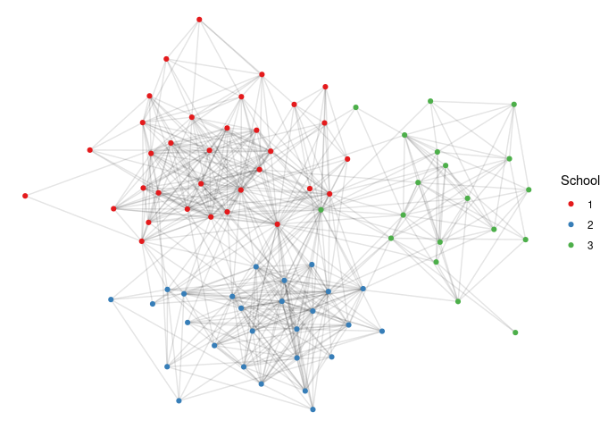
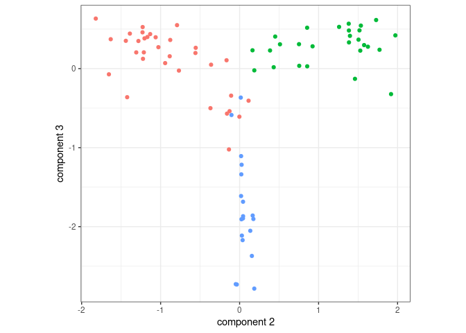

<!-- README.md is generated from README.Rmd. Please edit that file -->

# `osc`: An R implementation of Orthogonal Spectral Clustering

<!-- badges: start -->

[](https://lifecycle.r-lib.org/articles/stages.html#experimental)
[](https://CRAN.R-project.org/package=osc)
<!-- badges: end -->

Paper:
<https://www.tandfonline.com/doi/full/10.1080/10618600.2022.2081576>

## Installation

You can install the development version of `osc` like so:

``` r
devtools::install_github('johneverettkoo/osc')
```

## Example

This is a basic example of orthogonal spectral clustering applied on the
UK faculty network (see the `igraph` package). This is a graph of the
friendships among UK faculty. Each vertex also comes with a label
regarding the school to which each faculty member belongs. We’ll focus
on the first three schools.

``` r
library(ggplot2)

data('UKfaculty', package = 'igraphdata')
A <- as.matrix(igraph::as_adjacency_matrix(UKfaculty, type = 'both'))
A <- sign(A + t(A))
z <- igraph::vertex_attr(UKfaculty)$Group
K <- 3  # restrict to the first three labels
A <- A[z <= K, z <= K]
z <- z[z <= K]
n <- length(z)

ggraph::ggraph(A, layout = 'stress') + 
  ggraph::geom_edge_link(alpha = 1 / sqrt(n) / 2) + 
  ggraph::geom_node_point(aes(colour = factor(z)), 
                  show.legend = TRUE) + 
  labs(colour = 'School') + 
  theme_void() + 
  scale_colour_brewer(palette = 'Set1')
```



It was previously shown that the DCBM is a good fit for this graph.

``` r
cluster.out <- osc::osc(A, K = K, model = 'dcbm', assortative = TRUE)
```

A confusion matrix shows that OSC achieved 91.1% accuracy.

``` r
table(cluster.out$clustering, z)
   z
     1  2  3
  1  7  0 19
  2 26  0  0
  3  0 27  0
```

A scatterplot of the embedding reveals embedding vectors clustering
around three line segments, confirming that the DCBM is a good fit.

``` r
ggplot() +
  geom_point(aes(x = cluster.out$embedding[, 2],
                 y = cluster.out$embedding[, 3],
                 colour = factor(z))) +
  labs(x = 'component 2', y = 'component 3') +
  theme_bw() +
  theme(legend.position = 'none') +
  coord_fixed()
```


